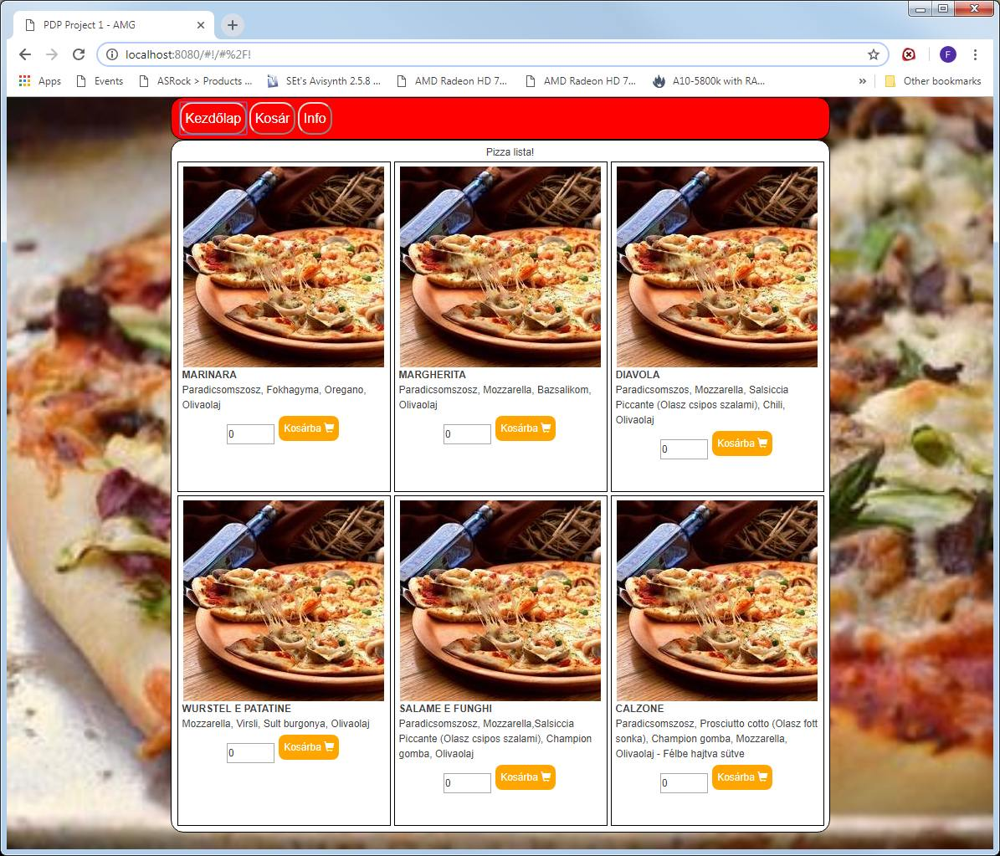

# pdpproject1
PDP Project1 build an example SPA using:
- webpack and plugins
- es6
- css/sass
- angularJs

## Project functional specifications/requirement were:
- menu (with routing for: about, home, cart)
- home screen list: number input (allowed values 0..10), add to cart button
  - if input is greater than 5 show warning (using validator)
  - at 0 and above 10 add to cart button disabled
  - when addign to cart number input changes to 0, button disabled
- cart page: no input/add for items, only empty button for each item
  - empty whole cart button
  - persistency for cart (sessin storage, later firebase optional)
- about page: (lorem ipsum etc.)

# Screenshot

